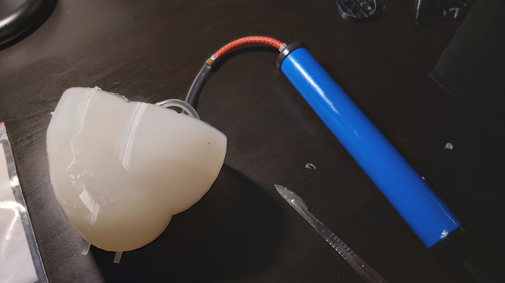
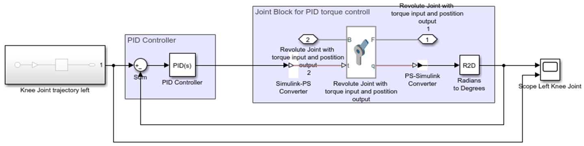
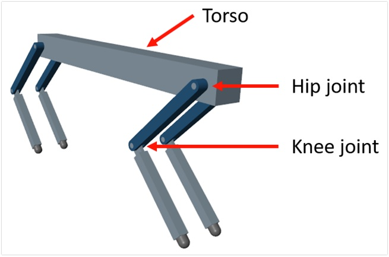

# **Biological Cybernetics**

This repository contains projects (for practical modules) and concept maps (for theoretical modules) of the biological cybernetics lecture.

## Projects

In the **soft robotics** project, my project partner and I developed a soft robotic heart, that is actuated via an air pump:



In the simulation practice module, we carried out multibody simulations, where we implemented different **control concepts (PID, bioinspired)** in Matlab/Simulink.



Furthermore, we learned to train a quadruped agent to walk by implementing **reinforcement learning**



## Folder Structure 
```
│projectdir
|
├── concept_maps                 <- Concept maps for the theoretical modules
|
├── simulation_practice          <- Matlab/Simulink models
│   ├── multibodySim_PIDcontrol  <- Multibody simulation and ideal torque control concept
│   ├── muscleImplementation     <- Muscle implementation and bioinspired control concept
│   ├── reinforcementLearning    <- Self-learning control of robots with artificial intelligence
│   ├── projectReport.pdf        <- Report for the three simulation_practice projects
|
├── softRobotics_heart           <- Project report and Blender file
|
├── README.md
```
